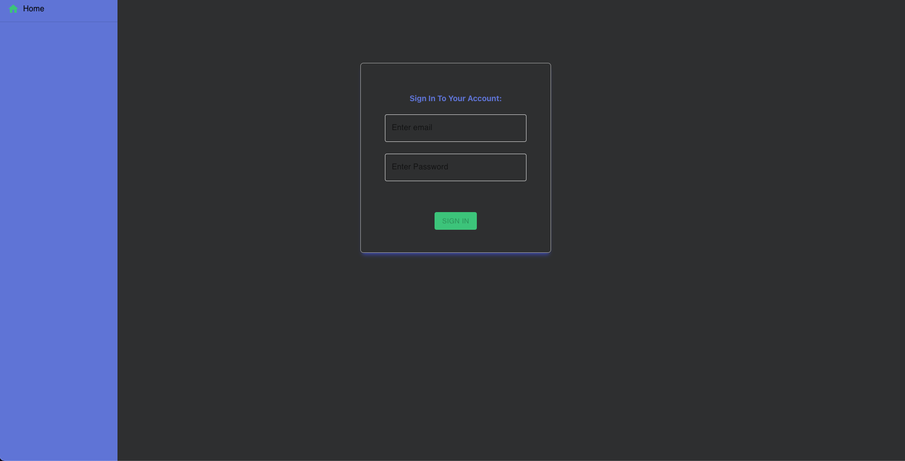

# Welcome to MoneyMoves
MoneyMoves is a web application developed in Typescript, Node.js, Express.js and PostgreSQL on the backend and Typescript and React.js on the frontend.

MoneyMoves offers the ability of sending and receiving money from other MoneyMove users. 

To fully get the MoneyMoves experience as a user, follow the steps on “How to make a MoneyMove” under the User section. However, if you would like to learn more about the development aspect of this application, begin in the Developer section.

## Developer

### Download to Local Device
To download this project to your local device, please clone the backend and frontend repositories for MoneyMoves. 

Please note, the following commands are assuming Typescript has already been installed. If not, please install Typescript before running the commands below. 

To setup and start the backend, run the following commands in the command line (CLI) on your device or text editor CLI. 
```
$ cd blend_backend
$ npm install
$ npm run start:watch ** this will automatically restart your server when changes are made.
The code will live on localhost:7890
$ tsc -w     ** this will compile the Typescript code to JavaScript automatically. 
```
Look at the env.example file for the environment variables that need to be declared with your own values.

To setup and start  the frontend, run the following commands in the command line(CLI) in your device or text editor CLI. 
```
$ cd money_moves_fe
$ npm install
$ npm  start
$ tsc -w     ** this will compile the Typescript code to JavaScript automatically.
```


### Overall Architecture Pattern
MoneyMoves Architecture was designed following the layered architecture principles; while the frontend holds the presentation and business layers, the backend manages the persistence and database layers. 

The frontend of MoneyMoves utilizes the advantages of the flux architecture by separating the different views into components that offer unidirectional data flow. For instance the parent component holds most of the logic that updates the data and state in that particular component and passes down the logic as props to its child(ren) components (presentational components). 

As for the backend of MoneyMoves the Models,Views, Controllers architecture was used to build vertical logic to follow the separation of concerns principle. The endpoints/routes were separated into authentication and transactions categories. Authentication stores the endpoint’s logic to sign up new users, sign in existing users, and logout users. The transactions category holds the logic for the private routes.  To post a transaction to another MoneyMoves user and to view one’s own transaction history. This architecture allows the view functions in the frontend to invoke the Model’s methods and service functions to interact with the PostgreSQL database. 

The models folder has different files that contain a class representing a table in the database. Each class has methods that are invoked in the view functions of the endpoints. Express middleware was used to create the endpoints using HTTP verbs to create a RESTful API.

 [running tests](https://facebook.github.io/create-react-app/docs/r)

## Database Design
When designing the database, security,  functionality and user satisfaction were all kept at the forefront of development.

MoneyMoves is a simple, yet powerful app that requires a couple of steps to fully use its services. MoneyMoves’ first priority is to keep sensitive information such as personal and bank information stored in a secure place. Thi is done by having the user create a third-party account with Stripe.com and only providing their name, email, password and stripe account id to sign up with MoneyMoves.

Making MoneyMoves efficient and simple was accomplished by only creating two tables to keep track of the signed up users (users_active ) and transactions made (transactions). By joining the information of these two tables, MoneyMoves is able to 
register new users, sign in existing users, allow transactions between users, and tracks all transaction activity.  


The users_active table keeps the information of the registered users such as: name, email, password_hash and connected_id. It automatically assigns each user a unique id that references another table in the database to access more information.  The user_active table and transaction table have a one-to-one and one-to many relationship. 


## REST API Endpoints
```
Method: POST
Endpoint: ‘/auth/signup’
Body: {
    id:string; 
    name:string; 
    email:string; 
    password_hash:string; 
    connected_acct_id: string;
},
Response: new users info { 
    id:string; 
    name:string; 
    email:string;
    password_hash:string; 
    connected_acct_id: string
    Authorization cookie : {}
}
--------------------------------------------------------------------------------------------------
Method: POST
Endpoint: ‘/auth/signin’
Body: {
    email:string; 
    password_hash:string; 
}
Response: new users info { 
    id:string; 
    name:string; 
    email:string;
    password_hash:string; 
    connected_acct_id: string
    Authorization cookie:{}
}
--------------------------------------------------------------------------------------------------

Method: POST
Endpoint: ‘/transactions/makeTransaction’
Body: {      
       sender_id: number;
       recipient_id: number;
       amount: number;
       payment_method_id: string
}
Response:{
       sender_id: number;
       recipient_id: number;
       amount: number;
       payment_method_id: string;
      Client_secret: string
}
--------------------------------------------------------------------------------------------------

Method: GET
Endpoint: ‘/transactions/transactionhistory/:recipientemail’
body: N/A
Response:[
    {
      senderid: string,
      name: string,
      email: string,
      amount: 50
      recipientid:string,
      paymentid: string
    }

]

```


## Coding Practices
MoneyMoves’ code was designed to be reusable and modular. During the designing phase of the frontend, it was noticed that the core structure of MoneyMoves was based on forms. However, all of the forms required different amounts of inputs. This is when the “CustomField” component was created to be reused across the application. For example, the CustomField component is reused by the Signup, Signin, and Transaction views. Every time this component is reused, different props are provided to adjust its functionality to a specific usage. 

To allow further decoupling of MoneyMoves, all of its code was written following the modular concept. The frontend was separated by Views which hold majority of the logic, Components that hold less logic, and lastly, Presentational components that hold no logic.  This is done for every view that MoneyMoves contains to achieve a unidirectional data flow for better data management.   It is also important to mention that each view/component/and presentational component within the frontend had a respective StyleSheet to keep organization throughout the UX/UI designing and styling process.  The backend is broken down into models, views, controllers and services. The models hold classes that interact with the database to send or grab data from it and pass it to the service layer(if there is one). The service layer interacts with third party services, which in this instance were Bcrypt and Stripe. 

Bcrypt hashes and verifies passwords coming in the request body for added security and protection of the user’s information. Whereas Stripe grabs the request body info to create a payment. These endpoints in the controllers are then used in views (frontend) for the user to dynamically interact with the database. 


## User

### How to make MoneyMoves

Before we get into how to start making MoneyMoves, it is important to mention that the user will need to create an account in stripe and create a connected account. Use this link  [stripe-connectp-account](https://dashboard.stripe.com/register/connect) and follow the steps.

Once the user has created a stripe account, save the account id that should start with  “acct_” and keep it handy since it is needed to create a MoneyMoves account.

Go to [MoneyMoves](https://themoneymoves.netlify.app/)  and click on the sign up button.

#### Home

The user can click “SIGNIN”  or “SIGNUP” to create an account in MoneyMoves.

#### Signup

Here on the sign up page, new users  will enter their name, email, password and connected account id number to create an account in MoneyMoves.  If the user does not have a connect account id number, click the “No Stripe account” link to be redirected to stripe to sign up and get a connect account id. Once all of the information is completed click the “sign up” button to be directed to the sign in page.

#### Sign-in

Here is the sign in page if a user has already registered.  MoneyMoves will require their email and password credentials in order to be directed to the transactions page.

#### Transactions

This is the transactions page, to begin making a transaction:
-The user needs to enter the email of the recipient the user would like to transfer money to. 
-Fill the card inputs with their credit card information.
-Click the transfer button to execute the money move.


#### Activities

This is the Activity page where the user can see the list of transactions they have made in the past.

To Logout the user needs to click the logout button on the upper left hand side.